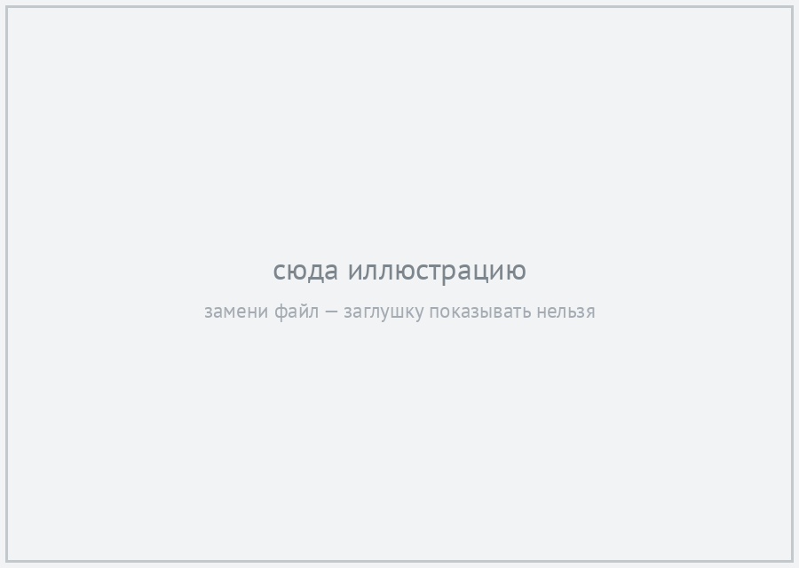

<!-- _class: title -->

# {{TITLE}}

{{AUTHOR}} 
{{AFFIL}} 
{{DATE}}

---

<!-- _class: figure-right air -->

Замени кикер на имя раздела

## Сюда — вывод слайда одним предложением, а не слово «Введение»

- Тезис, который раскрываешь голосом
- Второй тезис
- Третий

---

<!-- _class: figure-right -->

Патогенез

## Утверждение, которое доказывает картинка справа

Два-три предложения. Остальное — устно.

<figcaption>Рис. 1. Подпись</figcaption>

---

<!-- _class: statement -->

## Одна фраза, ради которой стоит этот слайд

Уточнение мельче, если без него мысль неполная

---

<!-- _class: dense -->

Результаты · n = ...

## Главный результат числом: «82% вернулись в спорт за 3 месяца»

| Столбец | Столбец | Столбец |
|---|---|---|
|  |  |  |

Источник: ...

