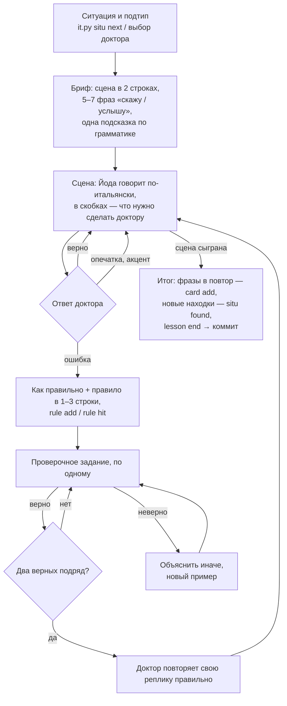

# Метод

## Урок: ситуация → сцена → ошибка → правило → задания → снова сцена

- **Один подтип за урок**, 5–15 минут. 5–7 новых фраз — потолок: больше за раз не запоминается.
- **Сцена — по уровню.** A1 — короткие реплики, одна новая конструкция на реплику; B1 — естественный темп.
- **Обращение.** С незнакомыми — Lei («Di dov'è?»); если доктор говорит продавцу tu — отметить, но это не ошибка
  смысла.
- **Опечатка ≠ ошибка.** Пропущенный акцент (perche → perché) поправляется мимоходом, без правила.
- **Правило коротко:** 1–3 строки и 2 примера. Не лекция.
- **Проверочные задания** — новые, не из примеров: перевести короткую фразу, вставить пропуск, поменять форму
  (un → uno, presente → passato prossimo). Закреплено = **два верных подряд**. Больше 8 заданий не мучить:
  правило уйдёт в вечерний повтор.

## Вечерний повтор

- Мягкий: 20:00, до 5 карточек, только те, которым пора. Нет таких — тишина.
- Карточки трёх видов: **сказать** (с русского на итальянский), **понять** (услышал итальянское — что значит),
  **правило** (Йода придумывает новое задание на правило).
- Оценка по смыслу, а не буква в букву: синоним и другой верный порядок слов — верно.

| Ответ | Оценка | Следующий раз (примерно) |
|---|---|---|
| сразу и без ошибок | easy — легко | через неделю и дальше |
| верно | good — верно | через 2 дня, потом 11, потом месяц |
| верно, но с заминкой, подсказкой или мелкой ошибкой (артикль, род) | hard — с трудом | завтра |
| не вспомнил или ошибка в главном | again — не вспомнил | завтра; в этот же вечер — разбор и переспрос |

Сроки считает FSRS: чем увереннее ответы, тем длиннее интервал. Фраза считается **выученной**, когда её
устойчивость дошла до трёх недель.

## Память

Всё, что нашли, проверили и выучили, — в `data/`, сводки для чтения — в корне. Журнал занятий —
`data/sessions.jsonl`: когда, какая ситуация, сколько фраз, какие правила, как прошёл повтор.
